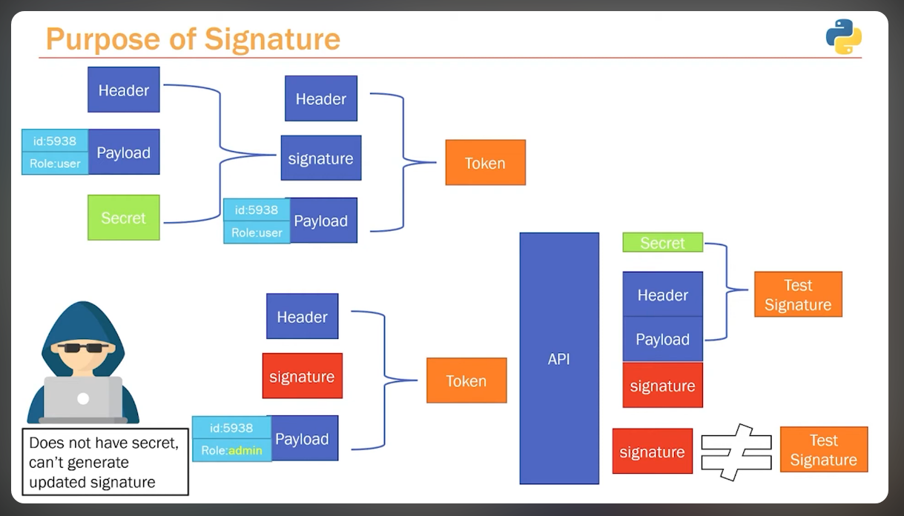

# 11. Authentication

## JWT Token Authentication

- Flow for how a user logs in and how they authenticate and are logged in
- Client will try login (path operation) **/login**  (username and password))
- Validates the credentials. If its validate then it will create a JWT token and will be sent as response.
- Now every other request will be made will be sent along with Token and the resource will be sent after the token is being validated.

**Jwt Token**
Token is made of up 3 individual pieces.
1) Header (Contains the meta data of the token, type and algorithm)
2) Payload (Contains any piece of information we want to send it) (If token is compromised anyone can see the content, so we need to be very careful with what we are sending)
3) Signature (Combination of 3 things, header + payload + secret and then encode with the algorithm)

## Login Flow
- User going to login (/login  {email, password})
- Going to hit the db and find the username or email
- Response we get is User {password(hashed)}
- How we validate the password? We take the attempted password and then hash it, check it against the stored db stored hashed password.
- If the password matches then we send back the token.
